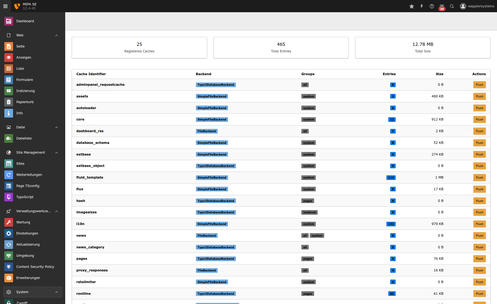
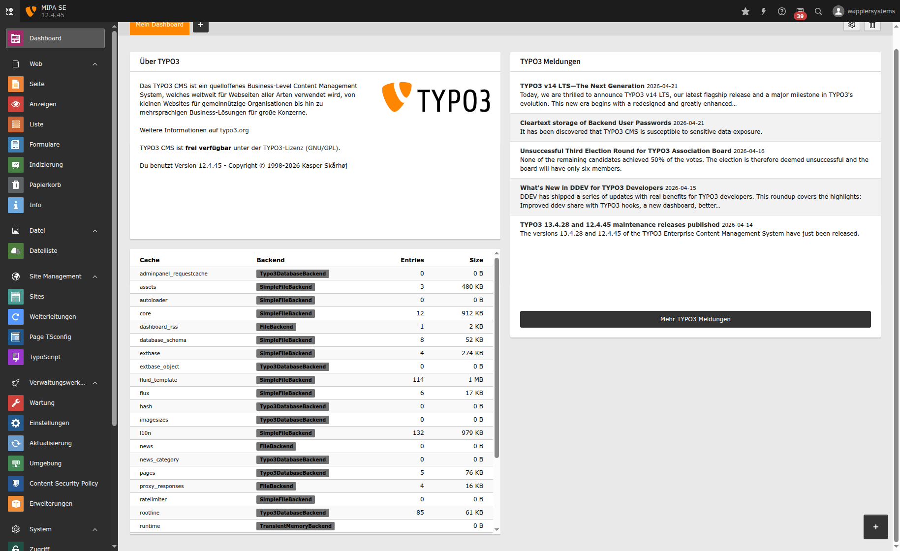

# TYPO3 Extension: Cache Monitor

Monitor all registered TYPO3 caches with statistics on entry count, size and backend type.

## Features

- **Backend Module** (System > Cache Monitor): Overview of all caches with entries, size, backend type, groups and flush action per cache
- **Dashboard Widget**: Compact cache overview table for the TYPO3 Dashboard
- **CLI Command** `cache:stats`: Full cache statistics on the command line

### Screenshots

#### Backend Module



#### Dashboard Widget



### Supported Cache Backends

| Backend | Entries | Size |
|---|---|---|
| FileBackend | yes | yes |
| SimpleFileBackend | yes | yes |
| Typo3DatabaseBackend | yes | yes |
| RedisBackend | yes | no |
| ApcuBackend | yes | no |
| NullBackend | 0 | 0 |

## Installation

```bash
composer require wapplersystems/cache-monitor
```

Then activate the extension:

```bash
vendor/bin/typo3 extension:setup
```

## Usage

### Backend Module

Navigate to **System > Cache Monitor** in the TYPO3 backend. Requires admin access.

### Dashboard Widget

Go to Dashboard, click **+ Add widget**, select **Cache Overview** from the System Info group.

### CLI

```bash
# Show all caches
vendor/bin/typo3 cache:stats

# Filter by group
vendor/bin/typo3 cache:stats --group=pages

# Sort by size (descending)
vendor/bin/typo3 cache:stats --sort=size

# Sort by entries (descending)
vendor/bin/typo3 cache:stats --sort=entries
```

Example output:

```
TYPO3 Cache Statistics
======================

+-------------------+----------------------+---------+----------+--------+
| Cache             | Backend              | Entries | Size     | Groups |
+-------------------+----------------------+---------+----------+--------+
| core              | SimpleFileBackend    | 12      | 911 KB   | system |
| pages             | Typo3DatabaseBackend | 3       | 35.8 KB  | pages  |
| proxy_responses   | FileBackend          | 1       | 4.77 KB  | all    |
| ...               |                      |         |          |        |
| Total (25 caches) |                      | 270     | 10.41 MB |        |
+-------------------+----------------------+---------+----------+--------+
```

## Requirements

- TYPO3 v12.4
- PHP 8.1+
- Optional: `typo3/cms-dashboard` for the dashboard widget

## License

GPL-2.0-or-later
